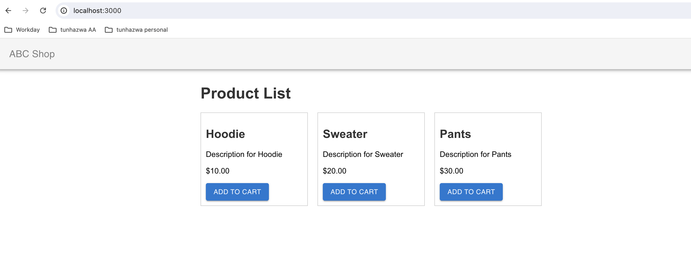
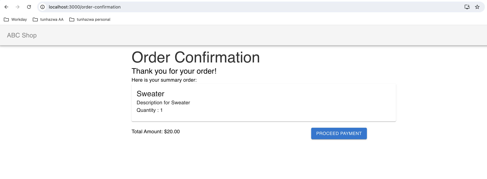

# Getting Started with Create React App

This project was bootstrapped with [Create React App](https://github.com/facebook/create-react-app).

## This project is created using:

- [x] Hooks
- [x] Redux

## Features

- Home (Product List Page)
- Cart 
- Order Confirmation 

## Requirement

- npm install -g 
- npm install -g -f (if the previous npm is not working)

In the project directory, you can run:

### `npm start`

Runs the app in the development mode.\
Open [http://localhost:3000](http://localhost:3000) to view it in your browser.

The page will reload when you make changes.\
You may also see any lint errors in the console.

# Screenshot

